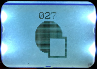

# Sangster's AVR Library

This library provides helpful code for developing toy projects with the
[ATmega328P AVR
microcontroller](https://www.microchip.com/wwwproducts/en/ATmega328p). You
likely don't want to use this for anything critical, as it was developed mainly
as a learning tool to teach myself embedded development.

It is a "[Header-Only](https://en.wikipedia.org/wiki/Header-only)" library. The
main reason for this is that this library relies on DEFINEs that aren't
available until your application is compiled. For example, many functions rely
on `F_CPU` to inform them of your device's clock-speed. A secondary benefit is
that `avr-gcc` seems to be able to compile smaller binaries this way.

## Getting Started

As this is a header-only library, you don't need to link any additional object
files. The headers will be installed in the standard AVR include directory, so
you can build your project the same way as before. ex:

```sh
avr-gcc -mmcu=atmega328p -DF_CPU=12345678L ...
```

### Installing

You can install this library on the local system with:

```sh
git clone "https://github.com/sangster/libsangster_avr.git"
cd libsangster_avr
./setup_buld.sh && sudo make install
```

Alternatively, on [Arch Linux](https://www.archlinux.org/), you can use the
provided [PKGBUILD](./PKGBUILD) file to install this library with the package
manager:

```sh
makepkg -s
pacman -U libsangster_avr-*.pkg.tar.xz
```

## Modules

### HD-44780 LCD

For Device: **Generic Hitachi 2x16 character LCD screen**

The super-common 2x16 character LCD screen. There seem to be a million
different versions of this LCD screen, so the model code may be different for
you.

 - `#include <sangster/lcd.h>` Functions for writing characters to the LCD.
 - `#include <sangster/lcd_charmap.h>` Defines constants for the extra
   characters supported by the controller.


### PCD8544 LCD

For Device: *PCD8544 LCD Controller*.

The Nokia 5110 a small b/w, 84x48, LCD screen driven by a PCD8544 controller.
This module utilities for communicating with the device, as well as functions
for basic drawing, text, bitmaps, and transactions.

 - `#include <sangster/pcd8544.h>` Include all the PCD8544-related code.
 - `#include <sangster/pcd8544/core.h>` Functions for communicating with the device.
 - `#include <sangster/pcd8544/draw.h>` Functions for drawing simple shapes. You
   can fill indivitual pixels, lines, circles, and rectangles.
 - `#include <sangster/pcd8544/text.h>` Functions for drawing text.
   [img2pcd8544](https://github.com/sangster/img2pcd8544) can be used to
   generate a font header file from an image file.
 - `#include <sangster/pcd8544/bmp.h>` Functions for drawing bitmaps.
   [img2pcd8544](https://github.com/sangster/img2pcd8544) can be used to
   generate a bitmap header file from an image file.
 - `#include <sangster/pcd8544/transaction.h>` Functions for drawing
   transactions. To avoid inefficently communicating with the device after every
   change, you can compose the entire screen in memory, then draw it on the
   device in a single pass.


#### Example code

This example program draws some shapes int the center of the screen, then shows
a counter at the top of the screen that is incrmented four times per second.

```c
#include <stdio.h>
#include <avr/interrupt.h>
#include <avr/io.h>
#include <avr/pgmspace.h>
#include <util/delay.h>
#include <sangster/pcd8544.h>
#include <sangster/pinout.h>

#define CX  (PCD_COLS / 2) // Center pixel, horizontally
#define CY  (PCD_ROWS / 2) // Center pixel, vertically

/// The LCD screen's pins and state
Pcd screen = {
    .pin_led  = PIN_DEF_ARDUINO_8,
    .pin_sce_ = PIN_DEF_ARDUINO_7,
    .pin_res_ = PIN_DEF_ARDUINO_6,
    .pin_dc   = PIN_DEF_ARDUINO_5,
    .pin_sdin = PIN_DEF_ATMEGA328P_MOSI,
    .pin_sclk = PIN_DEF_ARDUINO_10,
};
PcdDraw draw; ///< Interface for basical drawing primitives

// A 7x8 bitmap font for drawing the counter digits
const PROGMEM PcdBank DIGIT_BITMAP[] = {
   0x3e, 0x61, 0x51, 0x49, 0x45, 0x3e, 0x00, // '0'
   0x44, 0x42, 0x7f, 0x40, 0x40, 0x00, 0x00, // '1'
   0x62, 0x51, 0x51, 0x49, 0x49, 0x66, 0x00, // '2'
   0x22, 0x41, 0x49, 0x49, 0x49, 0x36, 0x00, // '3'
   0x18, 0x14, 0x52, 0x7f, 0x50, 0x10, 0x00, // '4'
   0x27, 0x45, 0x45, 0x45, 0x45, 0x39, 0x00, // '5'
   0x3c, 0x4a, 0x49, 0x49, 0x49, 0x30, 0x00, // '6'
   0x03, 0x01, 0x71, 0x09, 0x05, 0x03, 0x00, // '7'
   0x36, 0x49, 0x49, 0x49, 0x49, 0x36, 0x00, // '8'
   0x06, 0x49, 0x49, 0x49, 0x29, 0x1e, 0x00, // '9'
};
const PcdFont DIGITS =
    {.chars = DIGIT_BITMAP, .width = 7, .first = '0', .count = 10};


__attribute__((OS_main))
int main(void)
{
    pcd_setup(&screen);   // Turn on the screen
    pcd_clr_all(&screen); // The DDRAM state is unknown at startup. Blank it
    pcd_op_voltage(&screen, PCD_MAX_OP_VOLTAGE / 2); // Screen contrast to half

    pcd_draw_init(&draw, &screen); // Setup the drawing buffer

    sei(); // Enaable interrupts for _delay_ms(). This is unrelated to PCD8544

    // Draw a pointless circle and hollow square in the center of the screen
    pcd_circ(&draw, CX, CY, PCD_ROWS/3, PCD_BLACK);
    pcd_rect(&draw, CX + 0, CY + 0, CX + 20, CY + 20, PCD_BLACK);
    pcd_rect(&draw, CX + 2, CY + 2, CX + 18, CY + 18, PCD_WHITE);

    // Where to draw the text for it's horizontally centered
    const PcdIdx center = (PCD_COLS - pcd_text_width(DIGITS, 3)) / 2;
    uint8_t counter = 0;

    // Show a quarter-second counter at the top-center of the screen
    for (;;) {
        char str[4];
        sprintf(str, "%03d", counter++);
        pcd_print(&draw, &DIGITS, center, 0, str, PCD_BLACK);
        _delay_ms(250);
    }
}
```




#### References

 - [SparkFun: Nokia 5110 LCD](https://www.sparkfun.com/products/10168)
 - [PCD8544 Datasheet](https://www.sparkfun.com/datasheets/LCD/Monochrome/Nokia5110.pdf)
 - [GG0804A1FSN6G Datasheet](https://cdn.sparkfun.com/tutorialimages/GraphicLCDNokia3310/goldentek.pdf)


### MCU Pins
Encapsulates the code for managing individual pins

### Ring Buffer
A simple [Ring Buffer](https://en.wikipedia.org/wiki/Ring_buffer) implementation

### Realtime Clock (DS1307)
Read and write the current date/time from a RTC

### FAT32 filesystem on an SD Card

This module is a C transcription of William Greiman's SD C++ library. It does
almost everything you need with SD cards: read, write, list, create
directories. However, it only has partial support for long filenames, so try to
stick with 8.3 filenames for now.

#### Example code

This example creates (or appends to, if the file already exists) a file called
EXAMPLE.TXT. Then writes a new line with the value of a counter every second.

```c
#include <avr/interrupt.h>
#include <util/delay.h>
#include <sangster/pinout.h>
#include <sangster/sd.h>

SdClass SD = {
    .card = {
        .chip_select_pin = PIN_DEF_ATMEGA328P_SS,
        .mosi_pin        = PIN_DEF_ATMEGA328P_MOSI,
        .miso_pin        = PIN_DEF_ATMEGA328P_MISO,
        .clock_pin       = PIN_DEF_ATMEGA328P_SCK,
    }
};

__attribute__((OS_main))
int main(void)
{
    if (!sd_begin(&SD, NULL)) {
        while (1); // SD Card error. See SD.card.error_code
    }

    SdFile fp = sd_open(&SD, "EXAMPLE.TXT", O_WRITE | O_APPEND | O_CREAT);

    sei(); // Interrupts needed only for _delay_ms()

    uint8_t counter = 0;
    char str[4];

    for (;;) {
        itoa(scounter++, str, 10); // int 2 string
        sd_file_print(&file, str); // Write string to SD (buffered)
        sd_file_crlf(&fp);         // Write newline to SD (buffered)
        sd_file_sync(&fp);         // Syncronise SD buffer with physical card
        _delay_ms(1000);
    }
}
```


### Sonar (OSEPP HC-SR04)

For Device: *HC-SR04 Sonar*.

This module controls an ultrasonic transmitter/receiver. It can tell you how
far away the sonar is from... something (in centimeters or inches).

#### Example

This example app prints how far away the object in front of the sensor is. If
that object gets close or father away, the new distance will be printed on a
new line.

```c
#include <util/delay.h>
#include <sangster/pinout.h>
#include <sangster/sonar.h>
#include <sangster/usart.h>

SonarState sonar = {
    .trigger   = PIN_DEF_ARDUINO_12,
    .capture   = {&TCCR1B, ICES1},
    .interrupt = {&TIFR1, ICF1},
    .overflow  = {&TIFR1, TOV1},
    .max_distance_cm = 200
};

__attribute__((OS_main))
int main(void)
{
    pinout_make_output(sonar.trigger);

    usart_init(9600, FORMAT_8N1);
    UCSR0B |= _BV(TXEN0);

    char str[10];
    uint16_t prev_reading = 0;
    for(;;) {
        const uint16_t reading = sonar_ping(&sonar);
        if (reading == prev_reading) {
            continue;
        }
        prev_reading = reading;

        utoa(reading / US_ROUNDTRIP_CM, str, 10);
        usart_println(str);
        _delay_ms(50);
    }
}
```

#### References

 - [OSEPP: HC-SR04](https://www.osepp.com/electronic-modules/sensor-modules/62-osepp-ultrasonic-sensor-module)


### Timer

 - `#include <sangster/timer0.h>` A simple timer backed by TIMER0. You can get
   the number of milliseconds or microseconds which have ellapsed since calling
   `timer0_reset()` with `timer0_ms()` or `timer0_us()`, respectively.

#### Example

This example app performs some arbitrary long-running task, then reports (via
USART) how long it took, in milliseconds.

```c
#include <avr/interrupt.h>
#include <avr/io.h>
#include <sangster/timer0.h>
#include <sangster/usart.h>

ISR(TIMER0_OVF_vect)
{
    // This is required so the timer can keep time
    timer0_interrupt_callback();
}

__attribute__((OS_main))
int main(void)
{
    usart_init(9600, FORMAT_8N1);
    UCSR0B |= _BV(TXEN0);

    timer0_start();

    for(;;) {
        timer0_reset();

        something_that_takes_a_while();

        uint16_t ms = timer0_ms();
        usart_print("That took ");
        usart_16(ms);
        usart_println(" milliseconds.");
    }
}
```


### TWI/I2C

This module is a C transcription of Nicholas Zambetti's TWI C++ library.

`#include <sangster/twi.h>`

#### References

 - [I2C/TWI](https://en.wikipedia.org/wiki/I%C2%B2C)


### USART

Utilities for reading and writing to the connected serial device (ex: your PC).

 - `#include <sangster/usart.h>` Functions for reading and writing
 - `#include <sangster/usart_p.h>` Functions for writing to the serial device
   from PGMSPACE.

#### Example code

This example app simple reads characters sent and echos them back. To avoid
wasted memory, constant strings are served from PGMSPACE.

```c
#include <sangster/usart.h>
#include <sangster/usart_p.h>

__attribute__((OS_main))
int main(void)
{
    usart_init(9600, FORMAT_8N1);
    UCSR0B |= _BV(RXEN0) | _BV(TXEN0);

    usart_print_P(PSTR("echo> "));
    for(;;) {
        const uint8_t in = usart_recv(); // blocks until data is available
        usart_send(in);

        if (in == '\r') { // newlin received
          usart_print_P(PSTR("\necho> "));
        }
    }
}
```

#### References

 - [USART](https://en.wikipedia.org/wiki/USART)
 - [PGMSPACE utilities](https://www.nongnu.org/avr-libc/user-manual/group__avr__pgmspace.html)


### Misc. utility functions

 - `#include <sangster/util.h>` Utility functions that have no other home


## License

This project is licensed under the GPL License - see the [LICENSE](./LICENSE)
file for details

## Special Thanks

 - William Greiman, for the SD C++ code
 - Nicholas Zambetti, for the TWI C++ code
